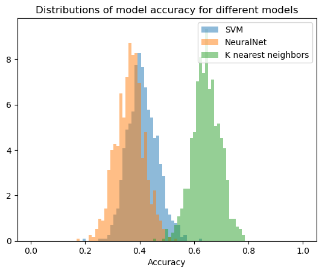

.. Copyright © 2023 Ernst Strüngmann Institute (ESI) for Neuroscience
.. in Cooperation with Max Planck Society

.. SPDX-License-Identifier: CC-BY-NC-SA-1.0

Parallel Bootstrap Tutorial
---------------------------

The following Python code demonstrates how to use ACME to perform a parallel bootstrap of the classification accuracy of three different scikit-learn classifiers.

We start by loading the wine dataset from scikit-learn and splitting it into training and testing sets using the `train_test_split` function from `sklearn.model_selection`.

.. code-block:: python

    from sklearn import datasets
    from sklearn.model_selection import train_test_split

    data = datasets.load_wine()
    X_train, X_test, y_train, y_test = train_test_split(data.data, data.target, test_size=0.5, random_state=42)

Training and evaluating the classifiers
---------------------------------------

Next, we define three scikit-learn classifiers: K nearest neighbors, a NeuralNet, and support vector machine. 
We train each of them on the training set and evaluate their accuracy on the test set using the `score` method.

.. code-block:: python

    from sklearn.neighbors import KNeighborsClassifier
    from sklearn.neural_network import MLPClassifier
    from sklearn.svm import SVC

    neighbors = KNeighborsClassifier(n_neighbors=3)
    NeuralNet = MLPClassifier(random_state=1, max_iter=300)
    SVM       = SVC(gamma='auto')

    neighbors.fit(X_train, y_train)
    NeuralNet.fit(X_train, y_train)
    SVM.fit(X_train, y_train)

    print(f"K nearest neighbors accuracy: {neighbors.score(X_test, y_test):.3f}")
    print(f"Naive Bayes  accuracy: {NeuralNet.score(X_test, y_test):.3f}")
    print(f"Support Vector Machine accuracy: {SVM.score(X_test, y_test):.3f}")

Because we evaluated the accuracy on the test data, we only get one accuracy measure per classifier.
However, we would like to have a distribution of accuracies to later compare the confidence intervals.
To achieve this, we can use `bootstrapping <https://en.wikipedia.org/wiki/Bootstrapping_(statistics)/>_`.

Bootstrapping and confidence intervals
-----------------------------------------

We define a function `bootstrap_model_accuracy` that resamples the test set *with* replacement and calculates the accuracy of each classifier on the resampled data.
We will use ACME to parallelize the bootstrapping process for efficiency.

.. code-block:: python

    from sklearn.utils import resample
    from acme import cluster_cleanup, esi_cluster_setup, ParallelMap
    import numpy as np

    def bootstrap_model_accuracy(X_test, y_test, seed):
        X_resamp, y_resamp = resample(X_test, y_test, replace=True)
        return SVM.score(X_resamp, y_resamp), NeuralNet.score(X_resamp, y_resamp), neighbors.score(X_resamp, y_resamp)

    client = esi_cluster_setup(partition="8GBXS", n_workers=10)
    nboot = 100
    seeds = np.linspace(0, nboot, nboot, dtype=int)

    with ParallelMap(bootstrap_model_accuracy, X_test, y_test, seeds, n_inputs=nboot, write_worker_results=False) as pmap:
        results = np.array(pmap.compute())

    cluster_cleanup(client) # close the cluster if you dont need it anymore

We now have a distribution of accuracies for each classifier. This means we can calculate a confidence interval for each classifier.

.. code-block:: python

    from scipy.stats import sem, t

    def CInt(data, confidence=0.95):
        n = len(data)
        m = np.mean(data)
        std_err = sem(data)
        h = std_err * t.ppf((1 + confidence) / 2, n - 1)
        return  m - h, m + h

    print(f"K nearest neighbors CI:{CInt(results[:, 2])[0]:.3f} to {CInt(results[:, 2])[1]:.3f}")
    print(f"NeuralNet CI: {CInt(results[:, 1])[0]:.3f} to {CInt(results[:, 1])[1]:.3f}")
    print(f"Support Vector Machine CI: {CInt(results[:, 0])[0]:.3f} to {CInt(results[:, 0])[1]:.3f}")

We can now go ahead and also plot our bootstrapped results as histograms.

.. code-block:: python

    # define bin edges for the histogram
    bins = np.linspace(0,1,90)
    # plot the distribution of the scores
    plt.hist(results[:,0],bins=bins,alpha=0.5,label="SVM",density=True)
    plt.hist(results[:,1],bins=bins,alpha=0.5,label="NeuralNet",density=True)
    plt.hist(results[:,2],bins=bins,alpha=0.5,label="K nearest neighbors",density=True)
    plt.xlabel("Accuracy")
    plt.title("Distributions of model accuracy for different models")
    plt.legend()

    
This is a simple procedure to compare the performance of different classifiers and we could have also achieved the same using a for loop. However,
the advantage of using ACME becomes apparent when we are using larger data sets and more complex models. In this case, the bootstrapping process can take a long time and
parallelization is necessary to speed up the process. ACME allows us to parallelize the bootstrapping process with just a few lines of code.

