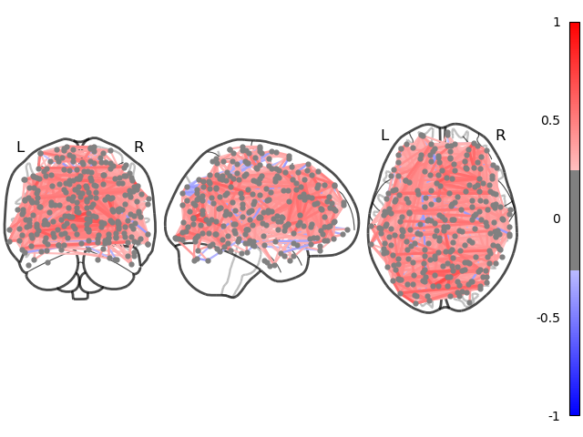

.. Copyright © 2025 Ernst Strüngmann Institute (ESI) for Neuroscience
.. in Cooperation with Max Planck Society

.. SPDX-License-Identifier: CC-BY-NC-SA-1.0

:orphan:

Functional Connectivity Tutorial
--------------------------------

.. note::
    These examples were run on the ESI HPC cluster. This is why we use
    :func:`~acme.esi_cluster_setup` to set up a parallel computing client.
    They are perfectly reproducible on any other cluster or local machine
    by instead using :func:`~acme.slurm_cluster_setup` or :func:`~acme.local_cluster_setup`
    respectively.

The following Python code demonstrates how to use ACME to concurrently compute the
`functional connectivity <https://en.wikipedia.org/wiki/Resting_state_fMRI#Functional>`_
in fMRI datasets of multiple subjects.

We start by downloading a publicly available fMRI dataset comprising
`BOLD <https://en.wikipedia.org/wiki/Blood-oxygen-level-dependent_imaging>`_
signals from 33 adults using the
`Nilearn <https://nilearn.github.io/stable/index.html>`_ package:

.. code-block:: python

    from nilearn import datasets

    data = datasets.fetch_development_fmri(age_group="adult")

The brain regions of interest (ROI) are taken from
`Power et al. 2011 <https://doi.org/10.1016/j.neuron.2011.09.006>`_ comprising
an atlas of 264 areas.

.. code-block:: python

    from nilearn import plotting

    atlas = datasets.fetch_coords_power_2011(legacy_format=False)

Next, we extract ROI-averaged time-series from the downloaded fMRI data.
To do this, we first use the
`MNI <https://en.wikipedia.org/wiki/Talairach_coordinates#Montreal_Neurological_Institute_(MNI)_templates>`_
coordinates of every ROI in the atlas as seeds for masking the fMRI data:

.. code-block:: python

    from nilearn.maskers import NiftiSpheresMasker

    atlasCoords = np.vstack((atlas.rois['x'],
                             atlas.rois['y'],
                             atlas.rois['z'])).T
    masker = NiftiSpheresMasker(seeds=atlasCoords, smoothing_fwhm=6,
                                radius=5., detrend=True,
                                standardize=True,
                                low_pass=0.1, high_pass=0.01, t_r=2)

Next, we pick a random subject (Number 0) and perform the signal extraction
removing nuisance regressors shipped with the fMRI dataset

.. code-block:: python

    timeseries = masker.fit_transform(data.func[0],
                                      confounds=data.confounds[0])

The extracted BOLD time-courses are contained in a ``(#time-points x #ROIs)`` = ``(168 x 264)`` array.
We choose `partial correlation <https://en.wikipedia.org/wiki/Partial_correlation>`_
as statistical dependence metric for computing the functional connectivity
across all 264 regions in our atlas.
Specifically, we compute the sparse inverse covariance matrix of the BOLD
data with a cross-validated choice of the :math:`\ell^1`-penalty using
scikit-learn's :class:`~sklearn.covariance.GraphicalLassoCV`

.. code-block:: python

    from sklearn.covariance import GraphicalLassoCV

    estimator = GraphicalLassoCV()
    estimator.fit(timeseries)

To visualize the computed inter-areal functional connectivity of Subject #0,
we use Nilearns :func:`~nilearn.plotting.plot_connectome`

.. code-block:: python

    from nilearn import plotting

    plotting.plot_connectome(estimator.covariance_, atlasCoords,
                             title=f"Subject #{subIdx}",
                             edge_threshold="95%", node_size=20,
                             colorbar=True, edge_vmin=-1, edge_vmax=1,
                             figure=fig)

Functional Connectivity in Parallel
===================================

In order to compute the functional connectome of multiple subjects concurrently,
we first capsulate the computational steps in a Python function called
``compute_connectome`` which we define inside a dedicated module ``connectome.py``:

.. code-block:: python

   import numpy as np
   from nilearn import datasets
   from nilearn.maskers import NiftiSpheresMasker
   from sklearn.covariance import GraphicalLassoCV
   from numpy.typing import NDArray

   # Format atlas coordinates
   atlas = datasets.fetch_coords_power_2011(legacy_format=False)
   atlasCoords = np.vstack((atlas.rois['x'],
                            atlas.rois['y'],
                            atlas.rois['z'])).T

   def compute_connectome(subidx : int) -> NDArray[np.float64]:
       """
       Compute functional connectome of single subject

       Parameters
       ----------
       subidx : int
           Subject number

       Returns
       -------
       con : 2D np.ndarray
           Functional connectivity matrix
       """

       # Take stock of data on disk
       data = datasets.fetch_development_fmri(age_group="adult")

       # Extract fMRI time-series averaged within spheres @ atlas coords
       masker = NiftiSpheresMasker(seeds=atlasCoords, smoothing_fwhm=6,
                                   radius=5., detrend=True,
                                   standardize=True, low_pass=0.1,
                                   high_pass=0.01, t_r=2)
       timeseries = masker.fit_transform(data.func[subidx],
                                         confounds=data.confounds[subidx])

       # Compute functional connectivity b/w brain regions
       estimator = GraphicalLassoCV()
       estimator.fit(timeseries)
       return estimator.covariance_

We now define a set of subjects to analyze and set up a parallel computing
client to do the actual processing

.. code-block:: python

   from connectome import compute_connectome
   from acme import esi_cluster_setup, ParallelMap

   subjectList = list(set(range(20)).difference([7, 8, 11, 12, 19]))
   myClient = esi_cluster_setup(n_workers=8, mem_per_worker="8GB",
                                cores_per_worker=2, partition="E880")

The return value of ``compute_connectome`` is always a
``(#ROIs x #ROIs)`` = ``(264 x 264)`` matrix for all subjects. Thus, we
want to store the computed functional connectivity matrices in a single
shared 3d-array for easier post-processing. We use :class:`~acme.ParallelMap`'s
``result_shape`` keyword for that:

.. code-block:: python

   with ParallelMap(compute_connectome,
                    subjectList,
                    result_shape=(264, 264, None)) as pmap:
       pmap.compute()

The resulting array can be accessed like any other HDF5 dataset, e.g., to
visualize the inter-areal functional connectivity of Subject #4, we
can use

.. code-block:: python

   import h5py

   sub4 = h5py.File(pmap.results_container, "r")["result_3"][()]
   plotting.plot_connectome(estimator.covariance_, atlasCoords,
                            title=f"Subject #{subIdx}",
                            edge_threshold="95%", node_size=20,
                            colorbar=True, edge_vmin=-1, edge_vmax=1,
                            figure=fig)

For more information about using ``result_shape`` and virtual HDF5 datasets,
see `Collect Results in Single Dataset <https://esi-acme.readthedocs.io/en/latest/userguide.html#collect-results-in-single-dataset>`_
