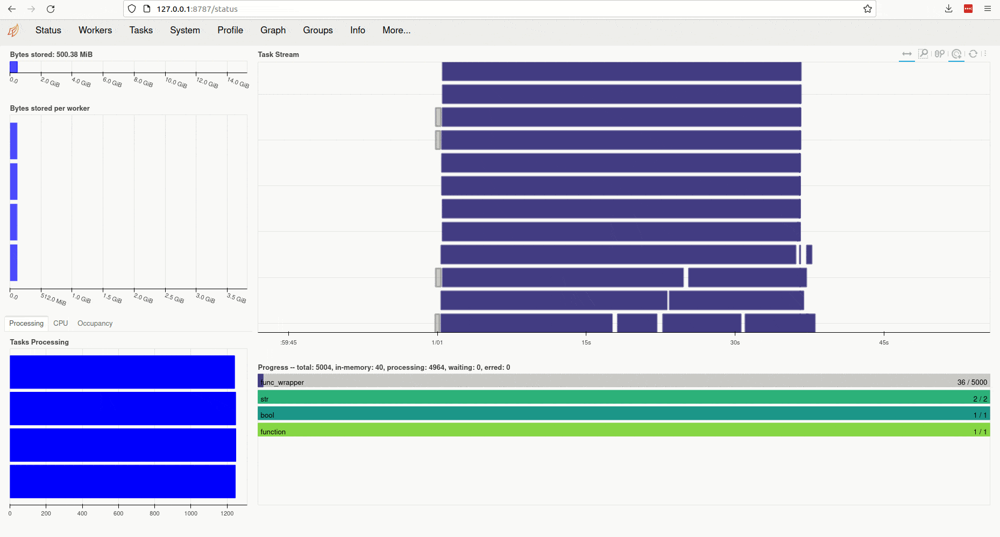

.. Copyright © 2023 Ernst Strüngmann Institute (ESI) for Neuroscience in Cooperation with Max Planck Society

.. SPDX-License-Identifier: BSD-3-Clause

User Guide
==========
Learn how to get the most out of ACME for your own work by running through a
quick but (hopefully) illustrative example that starts simple and subsequently
turns on ACME's bells and whistles.

.. contents:: Quick Links
    :depth: 3

Walkthrough
-----------
Assume the function defined below is supposed to be run multiple times
in parallel for different values of ``x``, ``y`` and ``z``

.. code-block:: python

    def f(x, y, z=3):
        return (x + y) * z

The following code calls ``f`` with four different values of ``x`` (namely 2, 4, 6 and 8)
sets ``y`` to 4 (for all calls) and similarly leaves ``z`` at its default value of 3:

.. code-block:: python

    from acme import ParallelMap
    with ParallelMap(f, [2, 4, 6, 8], 4) as pmap:
        results = pmap.compute()

What's going on here? ACME starts a dask :class:`distributed.Client` containing
four parallel workers (or fewer depending on available resources) that
call ``f`` with the provided input values to perform the following calculations
concurrently:

* **Computation #0**: 18 = (2 + 4) * 3 (``x = 2``, ``y = 4``, ``z = 3``)
* **Computation #1**: 24 = (4 + 4) * 3 (``x = 4``, ``y = 4``, ``z = 3``)
* **Computation #2**: 30 = (6 + 4) * 3 (``x = 6``, ``y = 4``, ``z = 3``)
* **Computation #3**: 36 = (8 + 4) * 3 (``x = 8``, ``y = 4``, ``z = 3``)

Where Are My Results?
^^^^^^^^^^^^^^^^^^^^^
By default results are saved to disk in HDF5 format and ``results`` is a list
of the corresponding filenames:

.. code-block:: python

    >>> results
    ['/my/current/workdir/ACME_20221007-100302-976973/f_payload/f_0.h5',
     '/my/current/workdir/ACME_20221007-100302-976973/f_payload/f_1.h5',
     '/my/current/workdir/ACME_20221007-100302-976973/f_payload/f_2.h5',
     '/my/current/workdir/ACME_20221007-100302-976973/f_payload/f_3.h5']

Note that ACME auto-generates a directory named ``ACME_YYYYMMDD-hhmmss-ffffff``
(encoding the current time as ``YearMonthDay-HourMinuteSecond-Microsecond``).
Each evaluation of ``f`` is stored in a dedicated HDF5 file, that in turn is
referenced in an aggregate results container ``pmap.results_container``
(comprised of external links):

.. code-block:: python

    >>> pmap.results_container
    '/my/current/workdir/ACME_20221007-100302-976973/f.h5'

In the above example, four HDF5 files are generated: ``f_0.h5``, ``f_1.h5``,
``f_2.h5``, ``f_3.h5``, each comprising the result of calling ``f`` with the provided
input values (i.e., ``f_0.h5`` stores the result of **Computation #0**: 18 = (2 + 4) * 3,
``f_1.h5`` holds the result of **Computation #1**: `24 = (4 + 4) * 3` and so on).
The collective results of all calls of ``f`` are gathered in a single HDF5
container ``f.h5`` whose group-/data-set structure follows the format shown below:

::

    comp_0
      └─ result_0
    comp_1
      └─ result_0
    comp_2
      └─ result_0
    comp_3
      └─ result_0

The contents of the containers can be accessed using `h5py <https://docs.h5py.org/en/latest/index.html>`_:

.. code-block:: python

    import h5py
    with h5py.File(pmap.results_container, "r") as h5f:
        comp0 = h5f["comp_0"]["result_0"][()]
        comp1 = h5f["comp_1"]["result_0"][()]
        comp2 = h5f["comp_2"]["result_0"][()]
        comp3 = h5f["comp_3"]["result_0"][()]

    print(comp0, comp1, comp2, comp3)
    >>> [18] [24] [30] [36]

The dataset name `"result_0"` stores the *first* return value of the
user-provided function ``f``. If ``f`` returns multiple quantities, analogously named
datasets `'result_0'`, `"result_1"`, `"result_2"`, ... are automatically created
in the constructed HDF5 containers. See :ref:`hdf5files` for more details.

.. note::

    By default, the aggregate results container generated by ACME does **not**
    contain actual data but only points to the corresponding HDF5 files
    found in the respective ``_payload`` directory. Thus, the results container
    is only meaningful in conjunction with its associated payload.

To override the target directory ACME writes HDF5 containers to, the
``output_dir`` keyword can be provided:

.. code-block:: python

    from acme import ParallelMap
    with ParallelMap(f, [2, 4, 6, 8], 4, output_dir="/path/to/folder") as pmap:
        results = pmap.compute()

Then

.. code-block:: python

    >>> results
    ['/path/to/folder/f_payload/f_0.h5',
     '/path/to/folder/f_payload/f_1.h5',
     '/path/to/folder/f_payload/f_2.h5',
     '/path/to/folder/f_payload/f_3.h5']

and

.. code-block:: python

    >>> pmap.results_container
    '/path/to/folder/f.h5'

.. note::

    While ACME's default storage format is HDF5, user-functions that return
    non-HDF compatible objects can be processed too as long as the returned
    quantities are serializable. By setting ``write_pickle`` to ``True``
    when calling :class:`~acme.ParallelMap`, ACME pickles results instead
    of creating HDF5 containers. See :ref:`pickling` for an example and more
    information. In addition, ACME uses an "emergency pickling" strategy to
    save results if at all possible: if the output of some computational runs
    cannot be stored in HDF5, ACME switches to on-demand pickling regardless
    of the provided ``write_pickle`` setting.

Alternatively, results may be collected directly in memory by setting
``write_worker_results`` to ``False``. This is **not** recommended, since
values have to be gathered from compute nodes via ethernet (slow) and
are accumulated in the local memory of the interactive node you are using
(potential memory overflow):

.. code-block:: python

    with ParallelMap(f, [2, 4, 6, 8], 4, write_worker_results=False) as pmap:
        results = pmap.compute()

Now ``results`` is a list of integers:

.. code-block:: python

    >>> results
    [18, 24, 30, 36]

Override Automatic Input Argument Distribution
^^^^^^^^^^^^^^^^^^^^^^^^^^^^^^^^^^^^^^^^^^^^^^
Next, suppose ``f`` has to be evaluated for the same values of ``x`` (again
2, 4, 6 and 8), but ``y`` is not a number but a NumPy array:

.. code-block:: python

    import numpy as np
    y = np.ones((3,)) * 4
    with ParallelMap(f, [2, 4, 6, 8], y) as pmap:
        results = pmap.compute()

This fails, because it is not clear which input is to be split up and distributed
across workers for parallel execution:

.. code-block:: python

    ValueError: <ParallelMap> automatic input distribution failed: found 2 objects containing 3 to 4 elements. Please specify n_inputs manually.

In this case, ``n_inputs`` has to be provided explicitly (``write_worker_results``
is set to ``False`` for illustration purposes only)

.. code-block:: python

    with ParallelMap(f, [2, 4, 6, 8], y, n_inputs=4, write_worker_results=False) as pmap:
        results = pmap.compute()

yielding

.. code-block:: python

    >>> results
    [array([18., 18., 18.]),
     array([24., 24., 24.]),
     array([30., 30., 30.]),
     array([36., 36., 36.])]

Note that setting ``n_inputs`` manually can also be used to execute a function
``n_inputs`` times with the same arguments (again ``write_worker_results``
is set to ``False`` for illustration purposes only):

.. code-block:: python

    with ParallelMap(f, 2, 3, n_inputs=4, write_worker_results=False) as pmap:
        results = pmap.compute()

Then

.. code-block:: python

    >>> results
    [15, 15, 15, 15]

This functionality is sometimes useful for routines that randomize their
in- and/or outputs. An example and more information is provided in :ref:`taskIDex`

Collect Results in Single Dataset
^^^^^^^^^^^^^^^^^^^^^^^^^^^^^^^^^
When evaluating functions that return a NumPy array (like in the example above),
it is sometimes beneficial to aggregate results in a single dataset. Assume
the four 1d-arrays of the above parallel evaluation of ``f`` are to be
collected in a single 2d-array. This can be achieved by specifying the keyword
``result_shape`` where a (single!) ``None`` entry delineates the "stacking dimension"
along which computed results are to be put together

.. code-block:: python

    y = np.ones((3,)) * 4
    with ParallelMap(f, [2, 4, 6, 8], y, n_inputs=4, result_shape=(None, 3)) as pmap:
        results = pmap.compute()

The generated container is structured as follows:

.. code-block:: python

    >>> h5f = h5py.File(pmap.results_container, "r")
    >>> h5f.keys()
    <KeysViewHDF5 ['result_0']>
    >>> h5f["result_0"]
    <HDF5 dataset "result_0": shape (4, 3), type "<f8">
    >>> h5f["result_0"][()]
    array([[18., 18., 18.],
           [24., 24., 24.],
           [30., 30., 30.],
           [36., 36., 36.]])

Instead of four HDF5 groups (`"comp_0"`, ..., `"comp_3"`) each containing one
dataset (`"result_0"`), only a single dataset `"result_0"` is generated, whose
dimension is set a-priori via ``result_shape = (None, 3)``: this
tells ACME that incoming results are 3-component vectors, that are to be stacked
along the first dimension (position of ``None``) of a 2d-dataset.

Similarly, results may be collected in memory by setting ``write_worker_results``
to ``False`` (not recommended):

.. code-block:: python

    y = np.ones((3,)) * 4
    with ParallelMap(f, [2, 4, 6, 8], y, n_inputs=4, result_shape=(None, 3), write_worker_results=False) as pmap:
        results = pmap.compute()

This yields:

.. code-block:: python

    >>> results
    [array([[18., 18., 18.],
            [24., 24., 24.],
            [30., 30., 30.],
            [36., 36., 36.]])]

Note that in contrast to the example given in the previous section
`Override Automatic Input Argument Distribution`_, ``results`` does **not**
contain four (3,)-arrays, but one (4, 3)-array. More information and additional
control options are discussed in :doc:`Advanced Usage and Customization <advanced_usage>`.

Reuse Worker Clients
^^^^^^^^^^^^^^^^^^^^^
Instead of letting ACME automatically start and stop parallel worker clients
witch each invocation of :class:`~acme.ParallelMap`, a dask :class:`distributed.Client`
can be customized and set up manually **before** launching the actual concurrent
computation. The convenience functions :func:`~acme.slurm_cluster_setup` (on HPC
clusters managed by the
`SLURM Workload Manager <https://slurm.schedmd.com/documentation.html>`_)
and :func:`~acme.local_cluster_setup` (on local multi-core machines) provide
this functionality by wrapping :class:`dask_jobqueue.SLURMCluster` and
:class:`distributed.LocalCluster`, respectively. Once a client has been set up,
any subsequent invocation of :class:`~acme.ParallelMap` automatically picks
up the allocated client and distributes computational payload across the
workers collected inside.

.. note::
    The routine :func:`~acme.esi_cluster_setup` is specifically geared to the
    SLURM setup of the ESI HPC cluster. If you are working on the ESI cluster,
    please use :func:`~acme.esi_cluster_setup` to allocate computing clients.

Alternatively, instead of manually setting up computing resources using the
``*_cluster_setup`` routines, any distributed client automatically sized and
started by :class:`~acme.ParallelMap` can be re-used for subsequent
computations by setting the ``stop_client`` keyword to ``False``.
Assume ACME is used on a HPC cluster managed by SLURM and suppose ``f``
needs to be evaluated for fixed values of ``x`` and ``y`` with ``z`` varying randomly 500 times between 1 and 10. Since ``f`` is a
very simple function, it is not necessary to spawn 500 SLURM workers (=jobs) for this.
Instead, allocate only 50 workers in the "smallest" available queue on your
cluster ("8GBXS" on the ESI HPC cluster), i.e., each worker has to perform
10 evaluations of ``f``. Additionally, keep the workers alive for re-use afterwards

.. code-block:: python

    x = 2
    y = 4
    rng = np.random.default_rng()
    z = rng.integers(low=1, high=10, size=500, endpoint=True)
    with ParallelMap(f, x, y, z=z, n_workers=50, partition="8GBXS", stop_client=False) as pmap:
        results = pmap.compute()

This yields

.. code-block:: python

    >>> len(results)
    500

In a subsequent computation ``f`` needs to be evaluated for 1000 samples of
``z``. In the previous call, ``stop_client`` was ``False``, thus the next
invocation of :class:`~acme.ParallelMap` re-uses the allocated :class:`distributed.Client`
object containing 50 SLURM workers:

.. code-block:: python

    z = rng.integers(low=1, high=10, size=1000, endpoint=True)
    with ParallelMap(f, x, y, z=z) as pmap:
        results = pmap.compute()

Note the info message:

.. code-block:: python

    <ParallelMap> INFO: Attaching to global parallel computing client <Client: 'tcp://10.100.32.5:39747' processes=50 threads=50, memory=400.00 GB>

Debugging And Estimating Resource Consumption
^^^^^^^^^^^^^^^^^^^^^^^^^^^^^^^^^^^^^^^^^^^^^
Debugging programs running in parallel can be quite tricky.
For instance, assume the function ``f`` is (erroneously) called with ``z``
set to ``None``. In a regular sequential setting, identifying the problem
is (relatively) straight-forward:

.. code-block:: python

    >>> f(2, 4, z=None)
    TypeError: unsupported operand type(s) for *: 'int' and 'NoneType'

However, when executing ``f`` in parallel using SLURM

.. code-block:: python

    with ParallelMap(f, [2, 4, 6, 8], 4, z=None) as pmap:
        results = pmap.compute()

the resulting error message can be somewhat overwhelming

.. code-block:: python

    Function:  execute_task
    args:      ((<function reify at 0x7f425c25b0d0>, (<function map_chunk at 0x7f425c25b4c0>,
    <function ACMEdaemon.func_wrapper at 0x7f42569f1e50>, [[2], [4], [None], ['/cs/home/fuertingers/ACME_20201217-160137-984430'],
    ['f_0.h5'], [0], [<function f at 0x7f425c34bee0>]], ['z', 'outDir', 'outFile', 'taskID', 'userFunc'], {})))
    kwargs:    {}
    Exception: TypeError("unsupported operand type(s) for *: 'int' and 'NoneType'")
    slurmstepd: error: *** JOB 1873974 ON esi-svhpc18 CANCELLED AT 2020-12-17T16:01:43 ***

To narrow down problems with parallel execution, the :meth:`~acme.ParallelMap.compute`
method of :class:`~acme.ParallelMap` offers the ``debug`` keyword. If enabled, all function calls
are performed in the local thread of the active Python interpreter. Thus, the actual execution
is **not** performed in parallel. This allows regular error propagation
and even permits the use of tools like `pdb <https://docs.python.org/3/library/pdb.html>`_
or ``%debug`` `iPython magics <https://ipython.readthedocs.io/en/stable/interactive/magics.html#magic-debug>`_.

.. code-block:: python

    with ParallelMap(f, [2, 4, 6, 8], 4, z=None) as pmap:
        results = pmap.compute(debug=True)

which results in

.. code-block:: python

    <ipython-input-2-47feb885f020> in f(x, y, z)
        1 def f(x, y, z=3):
    ----> 2     return (x + y) * z
    TypeError: unsupported operand type(s) for *: 'int' and 'NoneType'

In addition, ACME can be used to estimate memory consumption as well as runtime
of compute jobs *before* actually launching a full concurrent processing run. This
functionality permits to get a (rough) estimate of resource requirements for queuing
systems and it allows to test-drive ACME's automatically generated argument lists
prior to the actual concurrent computation. For instance,

.. code-block:: python

    >>> with ParallelMap(f, [2, 4, 6, 8], 4, dryrun=True) as pmap:
    >>>     results = pmap.compute()
    <ParallelMap> INFO: Performing a single dry-run of f simulating randomly picked worker #1 with automatically distributed arguments
    <ParallelMap> INFO: Dry-run completed. Elapsed time is 0.004725 seconds, estimated memory consumption was 0.01 MB.
    Do you want to continue executing f with the provided arguments? [Y/n] n

In general it is strongly recommended to make sure any function supplied
to :class:`~acme.ParallelMap` works as intended in a sequential setting prior to running
it in parallel.

Interactive Monitoring
^^^^^^^^^^^^^^^^^^^^^^
When ACME starts a :class:`distributed.Client`, dask automatically sets up
a `diagnostic dashboard <https://docs.dask.org/en/stable/dashboard.html>`_
for the client. The dashboard is a web interface that allows live monitoring
of workers and their respective computations. ACME displays the link
for connecting to the dashboard as soon as it successfully launched a new
distributed computing client. For instance, invoking :class:`~acme.ParallelMap`
on a local machine prints:

.. code-block:: python

    <local_cluster_setup> Cluster dashboard accessible at http://127.0.0.1:8787/status

Clicking on the link (or copy-pasting it to your browser) opens the client's diagnostic
dashboard. This web interface offers various ways to monitor the current
state, memory and CPU usage of parallel workers and also provides an overview
of the global status of the concurrent processing task started by :class:`~acme.ParallelMap`:

Wait, There's More...
---------------------
ACME attempts to be as agnostic of user-provided functions as possible. However,
there are some technical limitations that impose medium to hard boundaries as to
what a user-provided function ``func`` can and should do. Most important, input
arguments of ``func`` must be regular Python objects (lists, tuples, scalars,
strings, etc.) or NumPy arrays. If ACME's HDF5 storage backend is used, then
additionally ``func``'s return values must be HDF5 compatible (i.e., scalars,
arrays or strings). More information and technical background is provided in
:doc:`Advanced Usage and Customization <advanced_usage>`.
